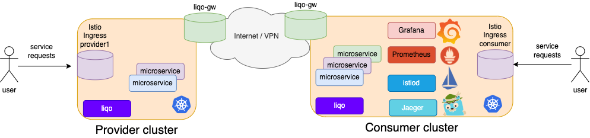
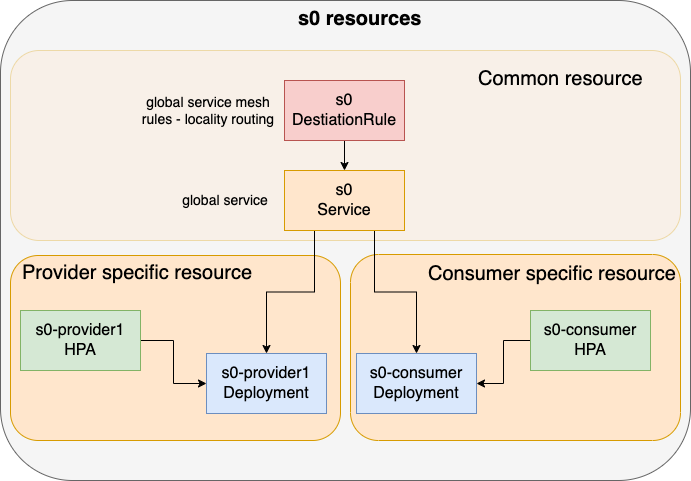
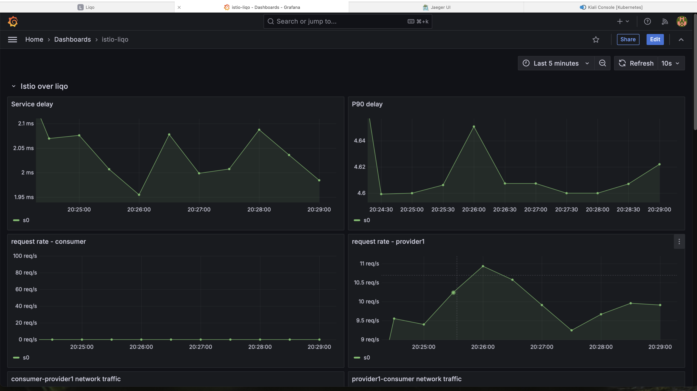
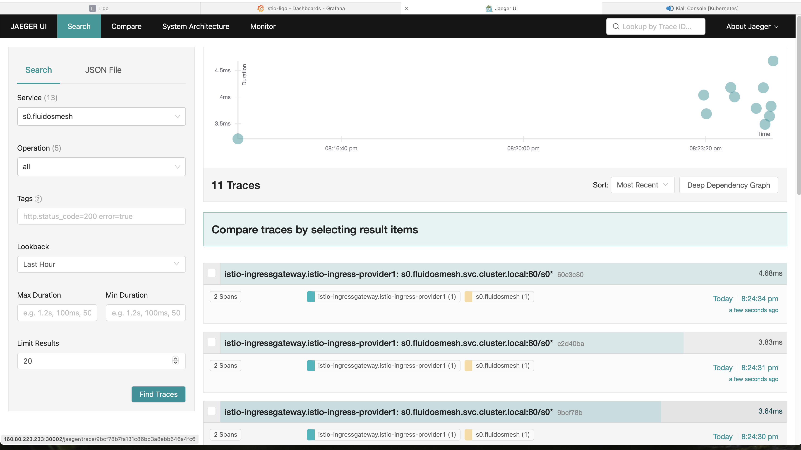
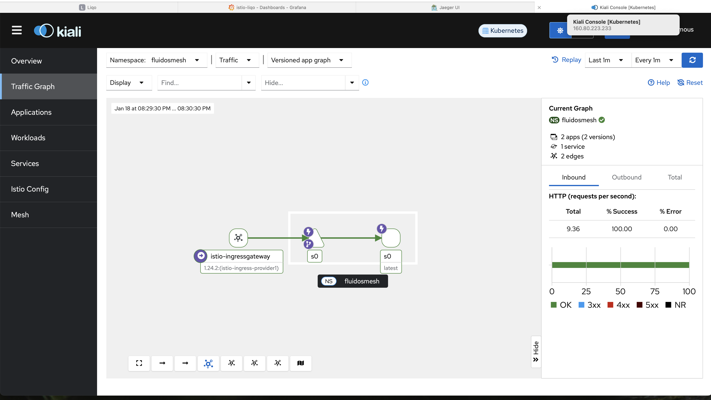

# Istio Service Mesh for LIQO Multi-Cluster Scenarios

- [Istio Service Mesh for LIQO Multi-Cluster Scenarios](#istio-service-mesh-for-liqo-multi-cluster-scenarios)
  - [Overview](#overview)
  - [Manual Peering of Consumer and Provider Clusters](#manual-peering-of-consumer-and-provider-clusters)
    - [Install LIQO](#install-liqo)
    - [Cluster Peering](#cluster-peering)
    - [Install Istio](#install-istio)
      - [Node Topology Labeling](#node-topology-labeling)
      - [Install Istio Control Plane in the Consumer Cluster](#install-istio-control-plane-in-the-consumer-cluster)
      - [Install Istio Ingress Gateway on Clusters](#install-istio-ingress-gateway-on-clusters)
  - [Install Telemetry Framework on the Consumer Cluster](#install-telemetry-framework-on-the-consumer-cluster)
  - [Install a Microservice](#install-a-microservice)
    - [Multi-Cluster Microservice Configuration](#multi-cluster-microservice-configuration)
    - [Microservice Namespace Offloading and Istio Injection](#microservice-namespace-offloading-and-istio-injection)
    - [Deploying a Microservice in the Consumer Cluster](#deploying-a-microservice-in-the-consumer-cluster)
    - [Access the Microservice from the Consumer and Provider Cluster](#access-the-microservice-from-the-consumer-and-provider-cluster)
    - [Deploying a Microservice in the Provider Cluster](#deploying-a-microservice-in-the-provider-cluster)
    - [Access the Microservice from the Consumer and Provider Cluster](#access-the-microservice-from-the-consumer-and-provider-cluster-1)
    - [Telemetry Data](#telemetry-data)

## Overview

This manual describes how to install and configure an [Istio](https://istio.io) service mesh using the [LIQO](https://liqo.io) framework.

The resulting configuration provides:
- A single Istio Control Plane running in the consumer cluster.
- An Istio Ingress Gateway running in each cluster.
- A telemetry framework made of Prometheus, Grafana, and Jaeger running in the consumer cluster.



In what follows, we present the simple case of two LIQO clusters, namely a **consumer** cluster and a **provider** cluster. The consumer cluster is named `consumer` and the provider cluster is named `provider1`. The configuration can be generalized to other use cases with more provider clusters.

In the first section of this manual, we present how to manually install LIQO on the two Kubernetes clusters and create a peering among them. This installation process is not needed in the case of the [FLUIDOS](https://github.com/fluidos-project) cloud-continuum platform, where the peering process between consumer and provider clusters is made automatically.

After the peering of clusters, we present how to install the Istio service mesh and the telemetry framework.

Finally, we present how to deploy, offload, and monitor a sample microservice in this scenario.

## Manual Peering of Consumer and Provider Clusters

To peer the consumer and provider clusters, follow the instructions in the [LIQO documentation](https://doc.liqo.io/user-guide/getting-started/). In summary, you need to install LIQO on both clusters and establish a peering relationship between them.

Below is an example of how to install LIQO on the consumer and provider cluster using the Calico network plugin with VXLAN tunneling and exposing external services through NodePort (i.e., no LoadBalancer is available).

> **Note:** LIQO uses port 6443 for peering establishment and Kubernetes NodePorts 30000-32767 for gateway traffic. Ensure these ports are open between the two clusters.

### Install LIQO

With the Calico CNI, it is necessary to disable BGP on LIQO interfaces on the clusters. To do this, run the following command on both clusters:

```bash
kubectl set env daemonset/calico-node -n kube-system IP_AUTODETECTION_METHOD=skip-interface=liqo.*
```

To **install LIQO** (v1.0.0-rc.3) on the consumer cluster, run the following commands from the master node:

```bash
curl --fail -LS "https://github.com/liqotech/liqo/releases/download/v1.0.0-rc.3/liqoctl-linux-amd64.tar.gz" | tar -xz
sudo install -o root -g root -m 0755 liqoctl /usr/local/bin/liqoctl
liqoctl install kubeadm --cluster-labels topology.kubernetes.io/zone=consumer --cluster-id consumer
```

And on the provider cluster, from the provider1 master node:

```bash
curl --fail -LS "https://github.com/liqotech/liqo/releases/download/v1.0.0-rc.3/liqoctl-linux-amd64.tar.gz" | tar -xz
sudo install -o root -g root -m 0755 liqoctl /usr/local/bin/liqoctl
liqoctl install kubeadm --cluster-labels topology.kubernetes.io/zone=provider1 --cluster-id provider1
```

### Cluster Peering

To peer the two clusters, run the following command on the consumer cluster, where `.kube/provider1-config` is the kubeconfig file of the provider cluster:

```bash
liqoctl peer --remote-kubeconfig .kube/provider1-config --server-service-type NodePort
```

Revise the quota of resources that can be used on the provider cluster, for example:

```bash
liqoctl create resourcepolicy provider1 --remote-cluster-id provider1 --cpu 20 --memory 20Gi
```

### Install Istio

#### Node Topology Labeling

Locality load balancing is a feature of many service mesh frameworks that is pivotal for multi-cluster scenarios where a microservice can have instances spread in many clusters. With locality load balancing, local instances are preferred, avoiding unnecessary cross-cluster back-and-forth interactions that can dramatically increase the latency of the application and the cross-cluster traffic.

To support Istio [locality load balancing](https://istio.io/latest/docs/tasks/traffic-management/locality-load-balancing/), it is necessary to label each node of the consumer and provider clusters with the `topology.kubernetes.io/zone` label. To do this, run the following commands from the consumer master for each node of the clusters, respectively:

```bash
kubectl label nodes <consumer-node-name> topology.kubernetes.io/zone=consumer
```

```bash
kubectl label nodes <provider-node-name> topology.kubernetes.io/zone=provider1 --kubeconfig .kube/provider1-config
```

#### Install Istio Control Plane in the Consumer Cluster

First, prepare consumer-only Istio control plane offloading as follows from the consumer master node:

```bash
kubectl create namespace istio-system
liqoctl offload namespace istio-system --namespace-mapping-strategy EnforceSameName --pod-offloading-strategy Local
```

Then install the Istio control plane. We use Helm with the following commands from the consumer master node:

```bash
helm repo add istio https://istio-release.storage.googleapis.com/charts
helm repo update
kubectl create namespace istio-system
helm install istio-base istio/base -n istio-system
helm install istiod istio/istiod -n istio-system --set global.proxy.tracer="zipkin" --wait
```

#### Install Istio Ingress Gateway on Clusters

To install the Istio Ingress Gateway in a specific cluster, create a dedicated namespace per cluster, offload each namespace, and install an Istio Ingress Helm chart in the different namespaces. In our case, we have two clusters, denoted as `consumer` and `provider1`.

First, prepare Istio-Ingress offloading in the provider cluster as follows from the consumer master:

```bash
kubectl create namespace istio-ingress-provider1
liqoctl offload namespace istio-ingress-provider1 --namespace-mapping-strategy EnforceSameName --pod-offloading-strategy LocalAndRemote --selector 'topology.kubernetes.io/zone=provider1'
```

Then install Istio-Ingress on the provider cluster as follows from the consumer master:

```bash
helm install istio-ingressgateway istio/gateway -n istio-ingress-provider1
```

To access the provider Istio Ingress Gateway, retrieve the NodePort and (possibly) LoadBalancer IP of the `istio-ingressgateway` service. To do this, run the following command from the consumer master:

```bash
kubectl get svc -n istio-ingress-provider1 --kubeconfig .kube/provider1-config
```

To install Istio Ingress in the consumer cluster, simply use Helm with the following commands from the consumer master node:

```bash
kubectl create namespace istio-ingress-consumer
helm install istio-ingressgateway istio/gateway -n istio-ingress-consumer
```

## Install Telemetry Framework on the Consumer Cluster

A popular telemetry framework is made of Prometheus, Grafana, Jaeger, and Kiali. These tools can be installed in the consumer cluster to monitor the application behavior as follow:

```bash
cd telemetry
sh ./monitoring.sh
cd ../
```

The script installs telemetry tools in the `monitoring` namespace and exposes the following NodePorts on the consumer cluster:
- 30000 for Prometheus
- 30001 for Grafana (admin:prom-operator)
- 30002 for Jaeger
- 30003 for Kiali

## Install a Microservice

### Multi-Cluster Microservice Configuration



This section describes a possible approach to deploy a microservice in a multi-cluster scenario enabling local horizontal autoscaling and [locality load balancing](https://istio.io/latest/docs/tasks/traffic-management/locality-load-balancing/), a pivotal request routing scheme that uses remote instances of a microservice only when local ones do not exist or are in a failure state.

A microservice is usually implemented as a set of Kubernetes Pods controlled by a Kubernetes Deployment, StatefulSet, or other types of workloads. For simplicity, we consider the case of Deployment as a workload.

Our approach provides the use of **different Deployments per cluster**. For example, in the figure, the microservice *s0* is implemented as a Deployment *s0-consumer* in the consumer cluster and as a Deployment *s0-provider1* in the provider cluster.

The Pods of these Deployments may differ in names, labels, and topology affinity rules, but they all run the same container image of the microservice. The Pods should share a common label, such as `app`, to be targeted by **a common Service**, and have a local topology label, such as `app-t`, to be targeted by the specific local Deployment.

Replication of the Pods of consumer and provider Deployments are controlled by **independent HPAs per cluster**, e.g., based on CPU utilization metrics.

A **common Istio Destination Rule per Service** should be configured to enable Istio locality load balancing.

### Microservice Namespace Offloading and Istio Injection

Our sample microservice runs in the `fluidosmesh` namespace, which needs to be offloaded as follows from the consumer master node:

```bash
liqoctl offload namespace fluidosmesh --namespace-mapping-strategy EnforceSameName --pod-offloading-strategy LocalAndRemote
```

Then, enable Istio sidecar injection in the `fluidosmesh` namespace:

```bash
kubectl label namespace fluidosmesh istio-injection=enabled
```

### Deploying a Microservice in the Consumer Cluster

Deploy the sample microservice with local HPAs and a global Service in the consumer cluster with:

```bash
kubectl apply -f sample-app/s0-dep-consumer.yaml
kubectl apply -f sample-app/s0-hpa-consumer.yaml
kubectl apply -f sample-app/s0-svc.yaml
```

Now the Pods of the microservice are running in the consumer cluster only.

```bash
fluidosmesh ~ % kubectl get pods -n fluidosmesh -o wide
NAME                        READY   STATUS    RESTARTS   AGE   IP              NODE          NOMINATED NODE   READINESS GATES
s0-consumer-65fbf7c647-6d42l   2/2     Running   0          36m   10.234.140.56   node2-consumer   <none>           <none>
```

Allow any Istio Ingress Gateway access to microservice `s0` and enable locality load balancing with:

```bash
kubectl apply -f sample-app/s0-ingress.yaml
kubectl apply -f sample-app/s0-dest-rule.yaml
```

### Access the Microservice from the Consumer and Provider Cluster

Discover the NodePort (or LoadBalancer) configuration of the Istio-Ingressgateway service in the consumer cluster and the provider cluster. Then, to access the microservice from the consumer cluster, use the IP address and NodePort of the Istio-Ingressgateway service in the consumer cluster. To access the microservice from the provider1 cluster, use the IP address and NodePort of the Istio-Ingressgateway service in the provider1 cluster.

```bash
curl http://<consumer-node-ip>:<consumer-nodeport>/s0
curl http://<provider1-node-ip>:<provider1-nodeport>/s0
```

Both commands should return the same response like the following one, as the locality load balancing should direct the request to the consumer microservice instance regardless of the access cluster.

```bash
You've hit s0-consumer-65fbf7c647-6d42l
```

### Deploying a Microservice in the Provider Cluster

Deploy the sample microservice with local HPAs also in the provider1 cluster with the following commands from the consumer master node:

```bash
kubectl apply -f sample-app/s0-dep-provider1.yaml
kubectl apply -f sample-app/s0-hpa-provider1.yaml
```

Now the Pods of the microservice are running in both the consumer and provider1 clusters.

```bash
fluidosmesh ~ % kubectl get pods -n fluidosmesh -o wide
NAME                        READY   STATUS    RESTARTS   AGE   IP              NODE          NOMINATED NODE   READINESS GATES
s0-consumer-65fbf7c647-6d42l   2/2     Running   0          36m   10.234.140.56   node2-consumer   <none>           <none>
s0-provider1-746dbc5d89-sc88m   2/2     Running   0          37s   10.236.97.29    provider1         <none>           <none>
```

### Access the Microservice from the Consumer and Provider Cluster

To access the microservice from the consumer and provider1 cluster, re-use the same `curl` commands used before.

```bash
curl http://<consumer-node-ip>:<consumer-nodeport>/s0
curl http://<provider1-node-ip>:<provider1-nodeport>/s0
```

Now commands should return different responses like the following ones, as the Istio locality load balancing policy should direct the request to the local microservice instance.

For consumer access, you should see something like this:

```bash
You've hit s0-consumer-65fbf7c647-6d42l
```

For provider1 access, you should see something like this:

```bash
You've hit s0-provider1-746dbc5d89-sc88m
```

### Telemetry Data

To monitor the application's behavior, use a Grafana dashboard that can be accessed at `http://<consumer-node-ip>:30001` with the credentials `admin:prom-operator`.

An example dashboard is available at `telemetry/fluidosmesh-dashboard.json`. The dashboard has some variables that need to be set to the correct values. The variables are:
- `istio_ingress_namespace`: `istio-ingress-provider1`
- `app_namespace`: `fluidosmesh`



To send traffic to the microservice, you can use the [JMeter](https://jmeter.apache.org) tool with the `jmeter/fluidosmesh.jmx` script. The script sends requests to the Istio Ingress Gateway of any of your choice clusters. To run the script, you need to have JMeter installed and run the following command from the consumer master node:

```bash
jmeter -n -t jmeter/fluidosmesh.jmx -Jhost=<consumer/provider1-node-ip> -Jport=<consumer/provider1-nodeport>
```

Jaeger trace and Kiali dashboards are also available at `http://<consumer-node-ip>:30002` and `http://<consumer-node-ip>:30003`, respectively.


