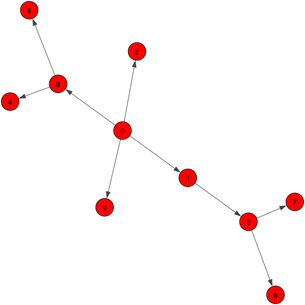

# FLUIDOS Webinar 

## Cluster config
- cloud cluster 
- edge1 cluster
- 1Gbps bandwidth
- 160ms RTT
- Openstack emulation
- Istio and Ingress already installed


## Create namespace for the app
```zsh
k create namespace fluidosmesh
```

## Offload the app namespace
```zsh
liqoctl offload namespace fluidosmesh --namespace-mapping-strategy EnforceSameName --pod-offloading-strategy LocalAndRemote
```

## Create the cloud app without istio support

Quickly present k8s manifests for services and deployments.
Deploy the APP

```zsh
k apply -f 'mubench-app/affinity-yamls/no-region-specified/cloud/no-subzone-specified' -n fluidosmesh
```
## Show the app status
```zsh
k get pods -n fluidosmesh -o wide
```

## Install ingress rule at the edge
```zsh
k apply -f 'mubench-app/istio-ingress-s0.yaml' -n fluidosmesh
```

## Load app without jmeter traffic
```zsh
./jmeter -t GMATest.jmx -Jserver 160.80.223.225 -Jport 30554 -Jthroughput 10
```

## Show the app performance
Open the Grafana, Kiali, Jaeger dashboards in your browser

## run s0,s1,s2,s3 on the edge
```zsh

k apply -f 'mubench-app/affinity-yamls/no-region-specified/edge1/no-subzone-specified/mubench-01000-Deployment-s0.yaml' -n fluidosmesh
k apply -f 'mubench-app/affinity-yamls/no-region-specified/edge1/no-subzone-specified/mubench-01000-Deployment-s1.yaml' -n fluidosmesh
k apply -f 'mubench-app/affinity-yamls/no-region-specified/edge1/no-subzone-specified/mubench-01000-Deployment-s2.yaml' -n fluidosmesh
k apply -f 'mubench-app/affinity-yamls/no-region-specified/edge1/no-subzone-specified/mubench-01000-Deployment-s3.yaml' -n fluidosmesh
```

## Show the app status

```zsh
k get pods -n fluidosmesh -o wide
```

## Show app performance
Delay is higher due to random routing of k8s creating Back-and-Forth Traffic Loops 


## Remove s0, s1, s2, s3 from edge
k delete -f 'mubench-app/affinity-yamls/no-region-specified/edge1/no-subzone-specified/mubench-01000-Deployment-s0.yaml' -n fluidosmesh
k delete -f 'mubench-app/affinity-yamls/no-region-specified/edge1/no-subzone-specified/mubench-01000-Deployment-s1.yaml' -n fluidosmesh
k delete -f 'mubench-app/affinity-yamls/no-region-specified/edge1/no-subzone-specified/mubench-01000-Deployment-s2.yaml' -n fluidosmesh
k delete -f 'mubench-app/affinity-yamls/no-region-specified/edge1/no-subzone-specified/mubench-01000-Deployment-s3.yaml' -n fluidosmesh

## Remove app from cloud
´´´
k delete -f 'mubench-app/affinity-yamls/no-region-specified/cloud/no-subzone-specified' -n fluidosmesh
´´´

## Enable istio on the fluidosmesh namespace
```zsh
k label namespace fluidosmesh istio-injection=enabled
```

## Enable Istio Locality Load Balancing
```zsh
k apply -f mubench-app/istio-resources -n fluidosmesh
```

## Deploy app on cloud 
```zsh
k apply -f 'mubench-app/affinity-yamls/no-region-specified/cloud/no-subzone-specified' -n fluidosmesh
```

## Show the app status and performance

Show performance on Grafana, kiali, jaeger dashboards.
Note the higer volume of information in the dashboards due to the istio sidecar injection.
```zsh
k get pods -n fluidosmesh -o wide
```

## run s0,s1,s2,s3 on the edge
```zsh

k apply -f 'mubench-app/affinity-yamls/no-region-specified/edge1/no-subzone-specified/mubench-01000-Deployment-s0.yaml' -n fluidosmesh
k apply -f 'mubench-app/affinity-yamls/no-region-specified/edge1/no-subzone-specified/mubench-01000-Deployment-s1.yaml' -n fluidosmesh
k apply -f 'mubench-app/affinity-yamls/no-region-specified/edge1/no-subzone-specified/mubench-01000-Deployment-s2.yaml' -n fluidosmesh
k apply -f 'mubench-app/affinity-yamls/no-region-specified/edge1/no-subzone-specified/mubench-01000-Deployment-s3.yaml' -n fluidosmesh
```

## Show the app status and performance

Show performance on Grafana, kiali, jaeger dashboards.
Note the reduced delay and no use of s0,s1,s2 and s3 at the cloud for the locality load balancing.   
```zsh
k get pods -n fluidosmesh -o wide
```

## Clean all
```zsh
k delete all --all -n fluidosmesh
k delete -f mubench-app/istio-resources -n fluidosmesh
k delete -f mubench-app/istio-ingress-s0.yaml -n fluidosmesh
liqoctl unoffload namespace fluidosmesh
k delete namespace fluidosmesh
```
